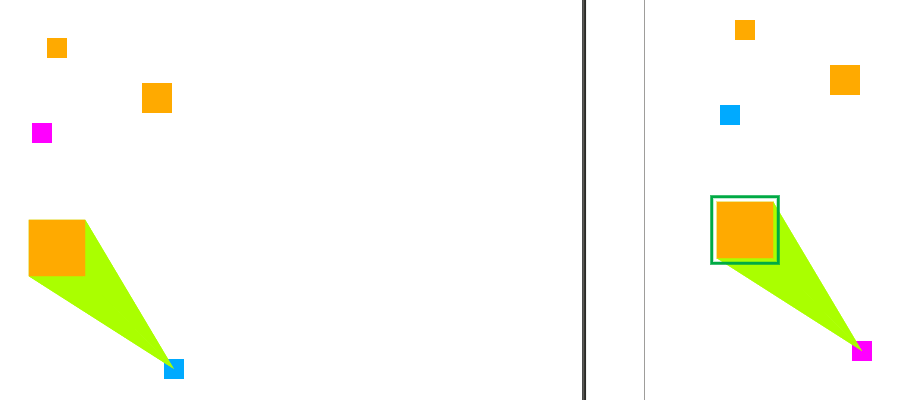

# Multiplayer Space Game!
A very basic prototype of a realtime multiplayer space game. Built on a stack of NodeJS + ExpressJS + Jade + SocketIO + JQuery.

## Screenshot!

## Installation
Make sure you have NodeJS and npm installed.
Clone this repository.
Inside the repository run '''npm install'''.
Then start the server with '''npm start'''.
Goto http://localhost:3000/ in your favorite browser to play it!

## Basics
WASD to move.
Mouse click on a yellow block to eat it!

## Multiplayer functionality
Multiplayer is provided by sending local player state updates every 100 ms,
to which the server responds with state updates of the full game state.
Movement interpolation with a 2 frame delay is performed to smooth movement between updates.
